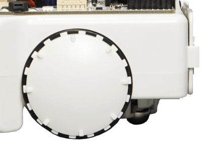
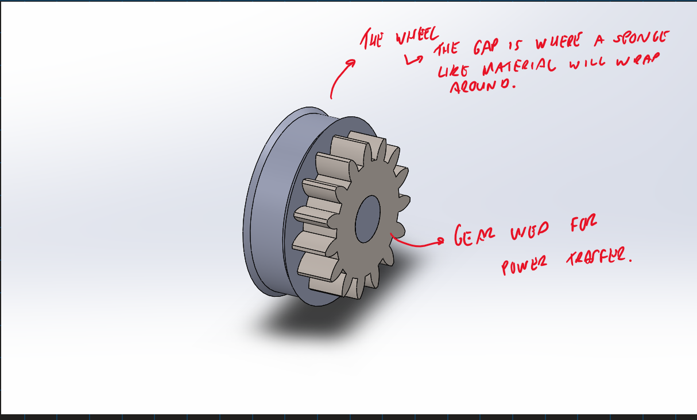

## Drive Mechanics V0.1

So, since we will be dealing with a lot of liquids we will need as much traction as possible. So I decided to use a 2-wheel drive (FWD) system with a freely rotating ball in the ball to provide stability.

Similar to Arcbotics Sparki:

So first things first let's design and simulate this drive system. We don't want to just keep 3D printing components over and over if things go wrong. Because they will... Instead, let's simulate a DC motor in Simulink and attach it to our Solidworks Part. This way we can run many simulations over and over, faster and cheaper.

Therefore, I am going to design a wheel with a fixed gear attached to it. So we can run the motor with a gear attachment and transfer power through the gear system. This way we can play around with gear ratio's in case power issues arise.

Here is the part:

